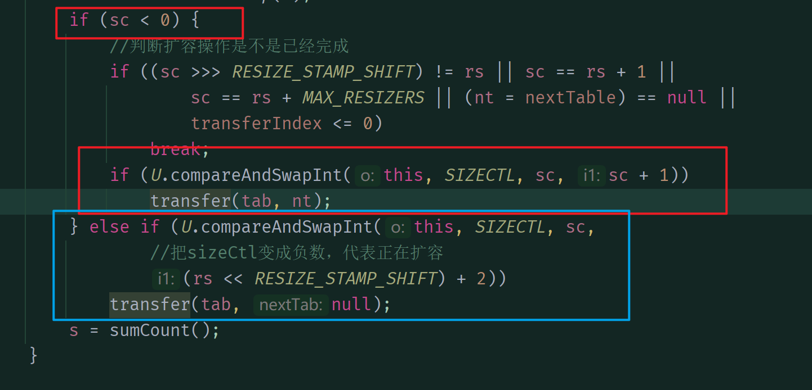
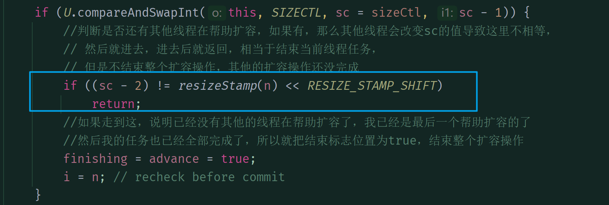

# ConcurrentHashMap源码学习

## 一些常量

最大数组大小，为什么要Integer.MAX_VALUE-8呢，因为这八个字节要拿来放元数据，也就是数组的固有属性，比如length

```java
static final int MAX_ARRAY_SIZE = Integer.MAX_VALUE - 8;
```

默认并发量，也就是最多多少个线程同时操作

```java
private static final int DEFAULT_CONCURRENCY_LEVEL = 16;
```

最少线程任务量，这个值在进行扩容迁移时会用到，多个线程同时扩容，需要分配给每个线程的最少任务量，也就是桶的个数，最少为16

```java
private static final int MIN_TRANSFER_STRIDE = 16;
```

SizeCtl中用于生成扩容表示戳记的位数。

```java
private static int RESIZE_STAMP_BITS = 16;
```

可以帮助扩容的最大线程数

```java
private static final int MAX_RESIZERS = (1 << (32 - RESIZE_STAMP_BITS)) - 1;
```

用于记录sizeCtl中的大小戳的位移位

```java
private static final int RESIZE_STAMP_SHIFT = 32 - RESIZE_STAMP_BITS;
```

各种不同的hash值

```java
//代表是一个fwd节点
static final int MOVED = -1; //ForwardingNode
//代表是一个红黑树节点
static final int TREEBIN = -2; // TreeBin
//占位节点的hash，用在computeIfAbsent方法中
static final int RESERVED = -3; // ReservationNode
//用来使得求得的hash一定是正数的hash值
static final int HASH_BITS = 0x7fffffff; // usable bits of normal node hash
```

cpu的核数

```java
static final int NCPU = Runtime.getRuntime().availableProcessors();
```

基本数量计数器，记录表的元素个数

```java
private transient volatile long baseCount;
```

表初始化和调整大小控件。
如果为负，则正在初始化该表或调整其大小：-1表示初始化，否则为-(1+活动的调整大小线程数)。
否则，当table为NULL时，保存创建时使用的初始表大小，或0表示默认大小。
初始化后，保存要根据其调整表大小的扩容阈值。

```java
private transient volatile int sizeCtl;
```

迁移时的索引，初始在表的最后面，不断减一直到数据迁移完成

```java
private transient volatile int transferIndex;
```

判断是否能够修改CounterCell数组的标志位，0，可修改，1，不可修改

```java
private transient volatile int cellsBusy;
```

保存数组元素数量的数组，每个元素有一个value值，把数组所有元素的value相加再加上baseCount就得到了数组的元素个数

```java
private transient volatile ConcurrentHashMap.CounterCell[] counterCells;
```

## Unsafe获取内存中的值

```java
// Unsafe mechanics
private static final sun.misc.Unsafe U;
private static final long SIZECTL;
private static final long TRANSFERINDEX;
private static final long BASECOUNT;
private static final long CELLSBUSY;
private static final long CELLVALUE;
private static final long ABASE;
private static final int ASHIFT;

static {
    try {
        U = sun.misc.Unsafe.getUnsafe();
        Class<?> k = ConcurrentHashMap.class;
        SIZECTL = U.objectFieldOffset
                (k.getDeclaredField("sizeCtl"));
        TRANSFERINDEX = U.objectFieldOffset
                (k.getDeclaredField("transferIndex"));
        BASECOUNT = U.objectFieldOffset
                (k.getDeclaredField("baseCount"));
        CELLSBUSY = U.objectFieldOffset
                (k.getDeclaredField("cellsBusy"));
        Class<?> ck = ConcurrentHashMap.CounterCell.class;
        CELLVALUE = U.objectFieldOffset
                (ck.getDeclaredField("value"));
        Class<?> ak = ConcurrentHashMap.Node[].class;
        //数组的初始内存地址
        ABASE = U.arrayBaseOffset(ak);
        //一个元素的大小
        int scale = U.arrayIndexScale(ak);
        if ((scale & (scale - 1)) != 0)
            throw new Error("data type scale not a power of two");
        //返回数组中一个元素所占的内存大小
        ASHIFT = 31 - Integer.numberOfLeadingZeros(scale);
    } catch (Exception e) {
        throw new Error(e);
    }
}
```

## 添加操作

### put方法

添加元素

```java
public V put(K key, V value) {
    return putVal(key, value, false);
}
```

### putVal方法

添加元素，首先求得元素所在的桶，也就是hash值

然后遍历这个桶，若是空的，就初始化这个桶

若表不为空且当前桶位置是空的，说明这个桶位置还没有放元素，就新建一个节点放上去结束

如果判断hash值为MOVED，说明有线程正在扩容，进行协助扩容

否则就开始真正的插入元素，首先锁住当前桶，再次判断当前索引位置的值没有变

判断hash值大于0，说明在这个桶上的是一条链表，那就遍历链表看能不能找到key对应的节点，有的话就修改值然后结束，没有就创建一个新节点放在链表尾部

判断hash值小于0，说明是一颗红黑树，调用红黑树的插入方法插入元素，插入后返回插入的节点，如果可以改变值的话就把值改变

最后判断创建的链表是不是大于树化阈值，大于就把链表树化，然后将表的元素个数加一

```java
final V putVal(K key, V value, boolean onlyIfAbsent) {
    if (key == null || value == null) throw new NullPointerException();
    //求得key的hash,一定是正数
    int hash = spread(key.hashCode());
    //链表的长度
    int binCount = 0;
    //遍历当前桶
    for(ConcurrentHashMap.Node<K, V>[] tab = table; ; ) {
        ConcurrentHashMap.Node<K, V> f;
        int n, i, fh;
        //表的长度为0或者是空，初始化表
        if (tab == null || (n = tab.length) == 0)
            tab = initTable();
        //此时内存中当前索引位置的值为空
        else if ((f = tabAt(tab, i = (n - 1) & hash)) == null) {
            //此时说明索引位置还没有放东西
            //比较内存中对应索引的值是不是真的是空的，
            // 如果为空，就新建一个节点放到对应位置
            if (casTabAt(tab, i, null,
                    new ConcurrentHashMap.Node<K, V>(hash, key, value, null)))
                break;
        } else if ((fh = f.hash) == MOVED)
            // ForwardingNode节点的hash值会是-1
            // 所以这里说明这是一个ForwardingNode节点
            //说明有线程正在扩容数组，则一起进行扩容操作
            tab = helpTransfer(tab, f);
        else {
            //开始准备在当前桶插入值
            V oldVal = null;
            synchronized (f) {
                //锁住当前桶对象
                if (tabAt(tab, i) == f) {
                    if (fh >= 0) {
                        //hash>0说明是一条链表
                        //链表长度
                        binCount = 1;
                        for(ConcurrentHashMap.Node<K, V> e = f; ; ++binCount) {
                            K ek;
                            //hash相同key相同，则找到了，然后替换旧值
                            if (e.hash == hash &&
                                    ((ek = e.key) == key ||
                                            (ek != null && key.equals(ek)))) {
                                oldVal = e.val;
                                if (!onlyIfAbsent)
                                    e.val = value;
                                break;
                            }
                            //遍历完了都还没找到，那就创建一个新节点放到链表的尾部
                            ConcurrentHashMap.Node<K, V> pred = e;
                            if ((e = e.next) == null) {
                                pred.next = new ConcurrentHashMap.Node<K, V>(hash, key,
                                        value, null);
                                break;
                            }
                        }
                    } else if (f instanceof ConcurrentHashMap.TreeBin) {
                        //说明是一棵红黑树
                        ConcurrentHashMap.Node<K, V> p;
                        binCount = 2;
                        //以红黑树的方式插入新值
                        if ((p = ((ConcurrentHashMap.TreeBin<K, V>) f).putTreeVal(hash, key,
                                value)) != null) {
                            oldVal = p.val;
                            //如果可以改变值就把值改变
                            if (!onlyIfAbsent)
                                p.val = value;
                        }
                    }
                }
            }
            //判断是否插入成功
            if (binCount != 0) {
                //大于树化阈值要树化
                if (binCount >= TREEIFY_THRESHOLD)
                    treeifyBin(tab, i);
                if (oldVal != null)
                    return oldVal;
                break;
            }
        }
    }
    //将数组的大小加1，因为添加了一个元素
    addCount(1L, binCount);
    return null;
}
```

### spread方法

求hash值，这个值一定是正数

```java
static final int spread(int h) {
    //HASH_BITS的二进制形式：0111 1111 1111 1111 1111 1111 1111 1111
    //最高位为0，其他是1，所以会把算出来的hash值置为正数，永远不会为负数
    return (h ^ (h >>> 16)) & HASH_BITS;
}
```

### initTable方法

初始化表格，当表格为空或者长度为0进行初始化，判断是否正在扩容，正在扩容就阻塞当前线程，没有的话就把sc置为-1，表示正在初始化，创建一个大小为指定容量的数组，并修改扩容阈值为0.75n

```java
private final ConcurrentHashMap.Node<K, V>[] initTable() {
    ConcurrentHashMap.Node<K, V>[] tab;
    int sc;
    while((tab = table) == null || tab.length == 0) {
        if ((sc = sizeCtl) < 0)
            //如果为负（sc<0），则正在初始化该表或调整其大小：-1表示初始化，否则为-(1+活动的调整大小线程数)。
            //否则，当table为NULL时，保存创建时使用的初始表大小，或0表示默认大小。
            //初始化后，保存下一个要扩容的阈值。
            Thread.yield(); // lost initialization race; just spin
        //yield会让出执行权并与其他线程共同竞争执行权
        //yield()应该做的是让当前运行线程回到可运行状态，以允许具有相同优先级的其他线程获得运行机会。
        // 因此，使用yield()的目的是让相同优先级的线程之间能适当的轮转执行。
        // 但是，实际中无法保证yield()达到让步目的，因为让步的线程还有可能被线程调度程序再次选中。
        else if (U.compareAndSwapInt(this, SIZECTL, sc, -1)) {
            //方法的作用是，读取传入对象o在内存中偏移量为offset位置的值与期望值expected作比较。
            //相等就把x值赋值给offset位置的值。方法返回true。
            //不相等，就取消赋值，方法返回false。
            //这也是CAS的思想，及比较并交换。用于保证并发时的无锁并发的安全性。
            //这里如果相等就把-1给到SIZECTL，保证其他线程进来时就走上面那个if
            //因为现在表都还没有初始化
            try {
                //进行double check，防止其他线程已经改变表的值
                if ((tab = table) == null || tab.length == 0) {
                    //判断size是否大于0，等于0就给个默认初始化容量，
                    // 大于说明有传参，那就用传进来的参数
                    int n = (sc > 0) ? sc : DEFAULT_CAPACITY;
                    //此时才会去新建一个表，然后赋值给表，也就是说concurrrenthashmap是懒惰初始化的
                    @SuppressWarnings("unchecked")
                    ConcurrentHashMap.Node<K, V>[] nt = (ConcurrentHashMap.Node<K, V>[]) new ConcurrentHashMap.Node<?, ?>[n];
                    table = tab = nt;
                    //sc变成原来的0.75倍，刚好是装载因子得到的最大扩容阈值
                    sc = n - (n >>> 2);//相当于0.75*sc
                }
            } finally {
                //重新赋值sizeCtl
                sizeCtl = sc;
            }
            break;
        }
    }
    return tab;
}

```

### tabAt方法

```java
//寻找指定数组在内存中i位置的数据。
@SuppressWarnings("unchecked")
static final <K, V> ConcurrentHashMap.Node<K, V> tabAt(ConcurrentHashMap.Node<K, V>[] tab, int i) {
    //ABASE,数组在内存中的起始地址，ASHIFT数组中每个元素所占的大小，例如int占4个字节
    /*
    * int a[]={3,4,5};
    * ABASE假设是0x7888
    * ASHIFT就是2，因为整形占4个字节，4的二进制表示形式是100,所以ASHIFT是2
    * i << ASHIFT，假设i是2，代表我要拿a[2],在内存中就是 数组起始地址+偏移地址
    * 所以就是 2*4+0x7888;
    * 因为我要拿第2个元素，每个元素占四个字节，所以要乘2
    * 所以也就是 ((long) i << ASHIFT) + ABASE要这么算的原因
    * */
    return (ConcurrentHashMap.Node<K, V>) U.getObjectVolatile(tab, ((long) i << ASHIFT) + ABASE);
}
```

### casTabAt

```java
static final <K, V> boolean casTabAt(ConcurrentHashMap.Node<K, V>[] tab, int i,
                                     ConcurrentHashMap.Node<K, V> c, ConcurrentHashMap.Node<K, V> v) {
    //obj ：包含要修改的字段对象；
    //offset ：字段在对象内的偏移量；
    //expect ： 字段的期望值；
    //update ：如果该字段的值等于字段的期望值，用于更新字段的新值；
    //通过我们传入的字段在对象中的偏移量来获取到字段的地址（对象首地址 + 字段在对象中的偏移量）；
    //然后调用 CompareAndSwap 方法比较字段的地址是否与我们期望的地址相等，如果相等则使用我们传入的新地址更新字段的地址；
    return U.compareAndSwapObject(tab, ((long) i << ASHIFT) + ABASE, c, v);
}
```

### helpTransfer方法

协助扩容，先判断是不是扩容完成了，完成了就什么也不做，直接退出，否则将sc+1，表示增加了一个协助扩容的线程，然后协助扩容

```java
/**
 * 如果正在调整大小，则帮助扩容。
 */
final ConcurrentHashMap.Node<K, V>[] helpTransfer(ConcurrentHashMap.Node<K, V>[] tab, ConcurrentHashMap.Node<K, V> f) {
    ConcurrentHashMap.Node<K, V>[] nextTab;
    int sc;
    //表不是空的且f是转移节点，且f的nextTable可用
    if (tab != null && (f instanceof ConcurrentHashMap.ForwardingNode) &&
            (nextTab = ((ConcurrentHashMap.ForwardingNode<K, V>) f).nextTable) != null) {
        //根据length得到一个标识符
        int rs = resizeStamp(tab.length);
        while(nextTab == nextTable && table == tab &&
                (sc = sizeCtl) < 0) {
            //-(1+活动的调整大小线程数)。
            //条件一：(sc >>> RESIZE_STAMP_SHIFT) != rs
            //true->说明当前线程获取到的扩容唯一标识戳 非 本批次扩容
            //false->说明当前线程获取到的扩容唯一标识戳 是 本批次扩容
            //条件二： JDK1.8 中有bug jira已经提出来了 其实想表达的是 =  sc == (rs << 16 ) + 1
            // true-> 表示扩容完毕，当前线程不需要再参与进来了
            //false->扩容还在进行中，当前线程可以参与
            //条件三：JDK1.8 中有bug jira已经提出来了 其实想表达的是 = sc == (rs<<16) + MAX_RESIZERS
            //条件四：transferIndex <= 0
            //      true->说明map对象全局范围内的任务已经分配完了，当前线程进去也没活干..
            //      false->还有任务可以分配。
            //总之一句话，这里表示的是扩容已经结束了，所以直接break退出了
            if ((sc >>> RESIZE_STAMP_SHIFT) != rs || sc == rs + 1 ||
                    sc == rs + MAX_RESIZERS || transferIndex <= 0)
                break;
            //如果扩容还没结束，就加入一起扩容，所以sc+1
            if (U.compareAndSwapInt(this, SIZECTL, sc, sc + 1)) {
                transfer(tab, nextTab);
                break;
            }
        }
        return nextTab;
    }
    return table;
}
```

### transfer方法

扩容，首先求出一个线程的最小任务量stride,这个值最少为16，然后判断是否是第一个来扩容的，是的话就初始化扩容的新表，大小为原来的2倍

不是就去循环里领取扩容任务，任务分配方式是每个线程处理一个stride任务量，直到最后的桶的个数已经小于stride，就把剩下的桶全部给来的这个线程处理，然后迁移是从原表倒着迁移，每次迁移一个桶的元素

迁移方式：如果桶是空的，就放一个fwd节点，然后去下一个桶，如果当前节点的hash=moved，说明有其他线程在迁移，自己就不要做了，去下一个桶，当这些都没有，就锁住桶，准备迁移，迁移方式：判断是链表还是红黑树，链表，就把链表分链，然后低链表放在新表的原索引处，高链表就放在新表的 原索引+原来的容量 索引处，最后把fwd节点放到旧表的桶上，告知其他线程这个桶已经迁移完成，如果是红黑树，也要先看作链表进行分链，分好后再判断是不是长度大于树化阈值，大于的话还要再次树化，迁移完后又去下一个桶继续迁移，然后线程任务全部处理完，判断是否还有其他线程在扩容，有的话就自己退出，没有了说明自己是最后一个扩容的线程了，就把结束标志位置为true表示扩容完全结束

```java
private final void transfer(ConcurrentHashMap.Node<K, V>[] tab, ConcurrentHashMap.Node<K, V>[] nextTab) {
    int n = tab.length, stride;
    //这里是根据cpu核数计算最小任务量，就是每个线程进行扩容至少要负责几个元素的扩容
    //如果算出来小于16，那就是16,也就是一个线程最少要处理16个桶
    if ((stride = (NCPU > 1) ? (n >>> 3) / NCPU : n) < MIN_TRANSFER_STRIDE)
        stride = MIN_TRANSFER_STRIDE; // subdivide range
    if (nextTab == null) {
        // initiating,说明是第一个线程进来扩容，还没有其他的
        try {
            //新建一个两倍大小的数组，然后赋值给nexttab，
            // 就是那个保存扩容之后的元素的数组
            @SuppressWarnings("unchecked")
            ConcurrentHashMap.Node<K, V>[] nt = (ConcurrentHashMap.Node<K, V>[]) new ConcurrentHashMap.Node<?, ?>[n << 1];
            nextTab = nt;
        } catch (Throwable ex) {      // try to cope with OOME
            sizeCtl = Integer.MAX_VALUE;
            return;
        }
        //赋值扩容数组
        nextTable = nextTab;
        //记录数组长度
        transferIndex = n;
    }
    int nextn = nextTab.length;
    //新建一个fw节点并把nexttab数组放进去
    ConcurrentHashMap.ForwardingNode<K, V> fwd = new ConcurrentHashMap.ForwardingNode<K, V>(nextTab);
    // advance 参数，该参数指的是是否继续递减转移下一个桶，
    // 如果为 true，表示可以继续向后推进，反之，说明还没有处理好当前桶，不能推进
    boolean advance = true;
    //转移结束标志位
    boolean finishing = false; // to ensure sweep before committing nextTab
    //死循环进行转移
    for(int i = 0, bound = 0; ; ) {
        ConcurrentHashMap.Node<K, V> f;
        int fh;
        //这个循环就是用来领任务的，一开始什么任务都没有，
        // 然后去领任务，领到后就可以退出循环去做任务
        while(advance) {
            //当可以扩容
            //保存下一个索引，以及下一个最小任务区间所在的索引
            int nextIndex, nextBound;
            //i-1大于了bound，表示已经把自己区间里的当前任务都做完了
            if (--i >= bound || finishing)
                advance = false;
            //表示已经没有任务可以分配
            else if ((nextIndex = transferIndex) <= 0) {
                i = -1;
                advance = false;
                //尝试改变nextIndex，改变的方式，当前下一个索引大于最小分配量吗，
                // 要是大于，说明还可以分，那就再分一个区间给她去转移，并把那个值记下来
            } else if (U.compareAndSwapInt(this, TRANSFERINDEX,
                    nextIndex,
                    nextBound = (nextIndex > stride ? nextIndex - stride : 0))) {
                //判断TRANSFERINDEX有没有变化，要是没变，就改成新的转移初始位置
                //如果已经没有最小分配区间了，直接让bound为0，
                // 这样i会一直进第一个if，所以就会把剩下的全部任务都跑完
                bound = nextBound;
                i = nextIndex - 1;
                advance = false;
            }
        }
        //i<0，当前任务做完了
        if (i < 0 || i >= n || i + n >= nextn) {
            int sc;
            if (finishing) {
                nextTable = null;
                table = nextTab;
                sizeCtl = (n << 1) - (n >>> 1);
                return;
            }
            if (U.compareAndSwapInt(this, SIZECTL, sc = sizeCtl, sc - 1)) {
                //判断是否还有其他线程在帮助扩容，如果有，那么其他线程会改变sc的值导致这里不相等，
                // 然后就进去，进去后就返回，相当于结束当前线程任务，
                // 但是不结束整个扩容操作，其他的扩容操作还没完成
                if ((sc - 2) != resizeStamp(n) << RESIZE_STAMP_SHIFT)
                    return;
                //如果走到这，说明已经没有其他的线程在帮助扩容了，我已经是最后一个帮助扩容的了
                //然后我的任务也已经全部完成了，所以就把结束标志位置为true，结束整个扩容操作
                finishing = advance = true;
                i = n; // recheck before commit
            }
        } else if ((f = tabAt(tab, i)) == null)
            //如果要转移的桶的位置元素为空，就直接放一个fw节点
            advance = casTabAt(tab, i, null, fwd);
        else if ((fh = f.hash) == MOVED)
            //如果当前节点正在转移，就去领新任务
            advance = true; // already processed
        else {
            //锁住一个桶元素
            synchronized (f) {
                //再次判断当前元素是不是已经移走了
                if (tabAt(tab, i) == f) {
                    ConcurrentHashMap.Node<K, V> ln, hn;
                    if (fh >= 0) {
                        //hash值大于0，是一条链表
                        //与长度相与，由于长度一定是2的n次幂，所以n的二进制表示形式一定是
                        // 100000000这样的，与他相与，所以只会得到0或者1
                        int runBit = fh & n;
                        ConcurrentHashMap.Node<K, V> lastRun = f;
                        //遍历链表
                        //这里做这个操作是为了避免不必要的循环，在这里遍历完后，runbit的值为0或者1
                        //lastrun代表最后一个相与得到rubbit值的节点，它之后的所有节点都与它一样
                        //与n相与都得到runbit
                        /*
                        *     a->b->c->d->f->e
                        * 假设b，c相与会得到1
                        * 1. runbit=0,lastrun=a
                        * 2. 不相同，runbit=1,lastrun=b
                        * 3. 相同，不改变
                        * 4. 不相同，runbit=0,lastrun=d
                        * 5. 从这之后开始都是相同的，所以循环结束runbit=0,lastrun=d
                        * */
                        for(ConcurrentHashMap.Node<K, V> p = f.next; p != null; p = p.next) {
                            int b = p.hash & n;
                            if (b != runBit) {
                                runBit = b;
                                lastRun = p;
                            }
                        }
                        //保存这个节点
                        if (runBit == 0) {
                            ln = lastRun;
                            hn = null;
                        } else {
                            hn = lastRun;
                            ln = null;
                        }
                        //再次遍历这个桶，结束条件是不等于lastrun，
                        // 因为等于lastrun说明后面都是一样的了
                        for(ConcurrentHashMap.Node<K, V> p = f; p != lastRun; p = p.next) {
                            int ph = p.hash;
                            K pk = p.key;
                            V pv = p.val;
                            if ((ph & n) == 0)
                                //相当于新建一个节点，
                                // 并将其后继设置为ln然后将ln前移，相当于头插法
                                //这里采用头插法，因为ln一开始后面就连着那些与他相同的节点
                                //就是与n相与都是runbit的节点，所以用头插法
                                ln = new ConcurrentHashMap.Node<K, V>(ph, pk, pv, ln);
                            else
                                hn = new ConcurrentHashMap.Node<K, V>(ph, pk, pv, hn);
                        }
                        //循环结束，两条链表已经分好了，接着把链放在对应的位置
                        //低链放在原索引处，高链放在原索引加旧表的长度处
                        setTabAt(nextTab, i, ln);
                        setTabAt(nextTab, i + n, hn);
                        //最后将当前这个旧表中的节点设置成fw节点，告诉其他线程，我正在扩容
                        setTabAt(tab, i, fwd);
                        //继续向前移动去获取桶
                        advance = true;
                    } else if (f instanceof ConcurrentHashMap.TreeBin) {
                        //说明这个桶上是一颗红黑树
                        //假设当前节点就是根节点
                        ConcurrentHashMap.TreeBin<K, V> t = (ConcurrentHashMap.TreeBin<K, V>) f;
                        //也要进行分链，分成高链表和低链表
                        ConcurrentHashMap.TreeNode<K, V> lo = null, loTail = null;
                        ConcurrentHashMap.TreeNode<K, V> hi = null, hiTail = null;
                        int lc = 0, hc = 0;
                        //获取这颗树作为链表时的首节点，然后遍历
                        for(ConcurrentHashMap.Node<K, V> e = t.first; e != null; e = e.next) {
                            int h = e.hash;
                            //完全新建一个树节点
                            ConcurrentHashMap.TreeNode<K, V> p = new ConcurrentHashMap.TreeNode<K, V>
                                    (h, e.key, e.val, null, null);
                            if ((h & n) == 0) {
                                //等于0放低链
                                if ((p.prev = loTail) == null)
                                    lo = p;
                                else
                                    loTail.next = p;
                                loTail = p;
                                ++lc;
                            } else {
                                //等于1放高链
                                if ((p.prev = hiTail) == null)
                                    hi = p;
                                else
                                    hiTail.next = p;
                                hiTail = p;
                                ++hc;
                            }
                        }
                        //判断是否大于解树化阈值或者是否已经被分成了两颗树
                        //解树化阈值好理解，就是链表节点少于6个，太少了，所以要把红黑树变成链表
                        //被分成两棵树要重新树化，这是因为之前这个地方就是一颗树，
                        // 现在高低链表都存在，说明有的树节点都被分到另一条链表去了，
                        // 当然现在这个已经不是红黑树了，所以就要把他重新创建成一颗红黑树
                        ln = (lc <= UNTREEIFY_THRESHOLD) ? untreeify(lo) :
                                (hc != 0) ? new ConcurrentHashMap.TreeBin<K, V>(lo) : t;
                        hn = (hc <= UNTREEIFY_THRESHOLD) ? untreeify(hi) :
                                (lc != 0) ? new ConcurrentHashMap.TreeBin<K, V>(hi) : t;
                        //构建完后一样放在对应位置
                        setTabAt(nextTab, i, ln);
                        setTabAt(nextTab, i + n, hn);
                        setTabAt(tab, i, fwd);
                        //然后去下一个桶
                        advance = true;
                    }
                }
            }
        }
    }
}
```

### addCount方法

在添加完元素后，增加数组的大小

主要有两部分，1，把数值加上 2，判断是否需要扩容，要扩容就再进行扩容

```java
private final void addCount(long x, int check) {
    //保存要加的值的value数组
    ConcurrentHashMap.CounterCell[] as;
    long b, s;
    //第一次加一定为空，后面可能不为空，这一部分是把数值加1的逻辑
    if ((as = counterCells) != null ||
            //使用cas操作，判断内存中的basecount与现在的是否相同
            // 如果相同就把base+1，那个x就是1，加完就结束了，这个if都进不去
            !U.compareAndSwapLong(this, BASECOUNT, b = baseCount, s = b + x)) {
        ConcurrentHashMap.CounterCell a;
        long v;
        int m;
        boolean uncontended = true;
        //as是空的，或者当前索引位置的cc对象是空的，
        //没有对象可以加，或者有但是那个值value加失败了，就进行全加
        if (as == null || (m = as.length - 1) < 0 ||
                (a = as[ThreadLocalRandom.getProbe() & m]) == null ||
                !(uncontended = U.compareAndSwapLong(a, CELLVALUE, v = a.value, v + x))) {
            fullAddCount(x, uncontended);
            return;
        }
        if (check <= 1)
            return;
        //调用函数求出真正的数组长度
        s = sumCount();
    }
    //这一部分是加完之后扩容的逻辑
    if (check >= 0) {
        ConcurrentHashMap.Node<K, V>[] tab, nt;
        int n, sc;
        //如果加完后s大于了阈值，就要扩容
        while(s >= (long) (sc = sizeCtl) && (tab = table) != null &&
                (n = tab.length) < MAXIMUM_CAPACITY) {
            //保存扩容标识
            int rs = resizeStamp(n);
            if (sc < 0) {
                //判断扩容操作是不是已经完成,如果完成了就什么也不做，直接退出
                if ((sc >>> RESIZE_STAMP_SHIFT) != rs || sc == rs + 1 ||
                        sc == rs + MAX_RESIZERS || (nt = nextTable) == null ||
                        transferIndex <= 0)
                    break;
                //没完成就把sc+1，意思是增加一个扩容线程，然后去协助扩容
                if (U.compareAndSwapInt(this, SIZECTL, sc, sc + 1))
                    transfer(tab, nt);
            } else if (U.compareAndSwapInt(this, SIZECTL, sc,
                    //说明是第一个进来扩容的线程，把sizeCtl变成负数，代表正在扩容
                    (rs << RESIZE_STAMP_SHIFT) + 2))
                transfer(tab, null);
            s = sumCount();
        }
    }
}
```

### sumCount方法

求得数组的大小，也就是concurrenthashmap元素的个数，根据basecount和countercell数组中的值求和得到

```java
final long sumCount() {
    ConcurrentHashMap.CounterCell[] as = counterCells;
    ConcurrentHashMap.CounterCell a;
    long sum = baseCount;
    if (as != null) {
        for(int i = 0; i < as.length; ++i) {
            if ((a = as[i]) != null)
                sum += a.value;
        }
    }
    return sum;
}
```

### fullAddCount方法

完成数组大小的数值加1操作，首先会尝试在baseCount上加1，如果成功就直接退出，否则就尝试去countercell数组找一个位置，然后把那个位置上的value+1，此时如果cc数组没有，还会对数组进行初始化，如果数组有但是当前索引位置没有值，就会创建一个cc对象然后把value赋值返回，如果有cc对象就把对象上的value值加1返回，此时可能一直加失败，就会发生扩容，线程会把数组扩容到cc数组原来的两倍大小，但是扩容的前提是数组长度小于cpu核数，如果大于了就不再扩容，因为扩了也没有意义

```java
// See LongAdder version for explanation
private final void fullAddCount(long x, boolean wasUncontended) {
    int h;
    //求出当前线程的hash值，其实就是要加1，
    // 在CounterCell数组中的哪个位置的元素中的value值加1呢
    //在这里就求出了那个位置的索引，然后准备去到那个位置，
    // 然后把那个位置上的COuntercell对象的value属性+1
        //此方法获取一个随机数，其实就是Random的子类，主要是用来在多线程中获取随机数用的
    if ((h = ThreadLocalRandom.getProbe()) == 0) {
        ThreadLocalRandom.localInit();      // force initialization
        h = ThreadLocalRandom.getProbe();
        wasUncontended = true;
    }
    //是否发生hash冲突
    boolean collide = false;                // 如果最后一个槽非空则为True
    for (;;) {
        //as,保存CounterCell的数组，a,是这个数组中的元素，
        // n，数组长度，v数组的元素的value属性的值
        ConcurrentHashMap.CounterCell[] as; ConcurrentHashMap.CounterCell a; int n; long v;
        if ((as = counterCells) != null && (n = as.length) > 0) {
            //数组长度不为空并且大于0，说明有CounterCell对象可以取，
            // 准备去取一个cc对象然后把他的value属性加1
            if ((a = as[(n - 1) & h]) == null) {
                //进入这里说明按照hash值求的索引，
                // 然后去cc数组找到那个索引位置的cc对象，但是那个cc对象为空
                if (cellsBusy == 0) {
                    //如果数组忙的话，意思是可能其他线程正在使用这个数组，
                    // cellbusy为0代表没有，而为1代表有，
                    // 此时当前线程就不能操作尝试附加新的细胞
                    //在这里就是不忙的情况，可以创建一个cc对象
                    //新建cc对象，并且将x赋值给value属性，但是此时这个cc对象还没放到数组中去
                    ConcurrentHashMap.CounterCell r = new ConcurrentHashMap.CounterCell(x); // Optimistic create
                    if (cellsBusy == 0 &&
                            U.compareAndSwapInt(this, CELLSBUSY, 0, 1)) {
                        //这里再次判断是不是忙的，因为可能其他线程又给占用了，
                        // 若不忙就把CELLBUSY置为1，表示正在忙，防止其他线程来干扰
                        //创建标志位为false，表示还没有把cc对象加到数组中去
                        boolean created = false;
                        try {               // Recheck under lock
                            ConcurrentHashMap.CounterCell[] rs; int m, j;
                            if ((rs = counterCells) != null &&
                                    (m = rs.length) > 0 &&
                                    rs[j = (m - 1) & h] == null) {
                                //判断数组不为空，长度大于0，
                                // 且在这个时候那个位置的元素依然是空的，说明可以放进去
                                rs[j] = r;
                                //然后就把这个cc对象放到数组里去，置创建标志位为true，代表真的创建了一个cc对象
                                created = true;
                            }
                        } finally {
                            //最后执行完了，把繁忙的标志位置为0，相当与放开锁，让其他线程可以操作
                            cellsBusy = 0;
                        }
                        //判断是否创建成功，如果成功了，那啥也不用做了，直接退出完成加1操作
                        // 否则的话就自旋重新去找机会插入
                        if (created)
                            break;
                        continue;           // Slot is now non-empty
                    }
                }
                collide = false;
            }
            else if (!wasUncontended)
                // CAS已经知道会失败
                // 但是依旧要重复，就是自旋
                wasUncontended = true;      // 之后继续重复
            else if (U.compareAndSwapLong(a, CELLVALUE, v = a.value, v + x))
                //这里是那个索引位置的cc对象不为空，那么就尝试去把他的value属性值加1，
                // 通过cas操作，判断与内存中的值是否相同，相同就加一，然后也结束了，就直接返回
                break;

            else if (counterCells != as || n >= NCPU)
                //数组长度大于cpu的核数，则无须扩容，直接重新计算hash然后重新找位置插入
                collide = false;            // At max size or stale
            else if (!collide)
                //置hash冲突为true，表示有hash冲突
                collide = true;
            else if (cellsBusy == 0 &&
                    U.compareAndSwapInt(this, CELLSBUSY, 0, 1)) {
                //当不忙的时候，把它置为1，准备对数组扩容
                //这里是一直有hash冲突，且数组长度还没到cpu的核数，
                //所以就想把数组扩容以降低hash冲突
                try {
                    if (counterCells == as) {// Expand table unless stale
                        //扩容的大小为2倍
                     ConcurrentHashMap.CounterCell[] rs = new ConcurrentHashMap.CounterCell[n << 1];
                        for (int i = 0; i < n; ++i)
                            rs[i] = as[i];
                        counterCells = rs;
                    }
                } finally {
                    cellsBusy = 0;
                }
                collide = false;
                continue;                   // Retry with expanded table
            }
            //重新得到一个索引，然后重新去找位置插入，就是自旋操作
            h = ThreadLocalRandom.advanceProbe(h);
        }
        //这里是数组都是空的，还没创建呢，直接给她建一个数组
        else if (cellsBusy == 0 && counterCells == as &&
                U.compareAndSwapInt(this, CELLSBUSY, 0, 1)) {
            //一样的，置标志位，然后置初始化为false
            boolean init = false;
            try {                 
                // Initialize table,如果表没有变化的话
                if (counterCells == as) {
                    //默认建2个元素的数组
                    ConcurrentHashMap.CounterCell[] rs = new ConcurrentHashMap.CounterCell[2];
                    //把对应索引位置的cc对象的value属性的值置为1，就是加一操作
                    rs[h & 1] = new ConcurrentHashMap.CounterCell(x);
                    //赋值对象
                    counterCells = rs;
                    //置标志位为true
                    init = true;
                }
            } finally {
                cellsBusy = 0;
            }
            //如果标志位为true，表示已经插入成功了，就直接返回了
            if (init)
                break;
        }
        //最后一种情况，数组还没创建，就尝试去直接把basecount+1，
        // 成功就直接返回了，其他都不用做了
        else if (U.compareAndSwapLong(this, BASECOUNT, v = baseCount, v + x))
            break;                          // Fall back on using base
    }
}
```

### putTreeVal方法

在红黑树上添加一个节点，其他都和hashmap相同，主要是在添加完后的平衡操作，会加一个LockSupport锁,平衡完后又会解锁

```java
final ConcurrentHashMap.TreeNode<K, V> putTreeVal(int h, K k, V v) {
    Class<?> kc = null;
    boolean searched = false;
    for(ConcurrentHashMap.TreeNode<K, V> p = root; ; ) {
        int dir, ph;
        K pk;
        if (p == null) {
            //如果根是空的，说明插入的是根节点，直接创建一个新的
            first = root = new ConcurrentHashMap.TreeNode<K, V>(h, k, v, null, null);
            break;
            //开始查找
        } else if ((ph = p.hash) > h)
            dir = -1;
        else if (ph < h)
            dir = 1;
        else if ((pk = p.key) == k || (pk != null && k.equals(pk)))
            //找到相同的key就返回，直接修改值就行了
            return p;
        else if ((kc == null &&
                (kc = comparableClassFor(k)) == null) ||
                (dir = compareComparables(kc, k, pk)) == 0) {
            //根据搜索标志递归搜索左右子树
            if (!searched) {
                ConcurrentHashMap.TreeNode<K, V> q, ch;
                searched = true;
                if (((ch = p.left) != null &&
                        (q = ch.findTreeNode(h, k, kc)) != null) ||
                        ((ch = p.right) != null &&
                                (q = ch.findTreeNode(h, k, kc)) != null))
                    //找到就返回
                    return q;
            }
            //这都还没找到，说明不存在，就需要新建一个树节点插入了
            dir = tieBreakOrder(k, pk);
        }
        ConcurrentHashMap.TreeNode<K, V> xp = p;
        //判断是插入在叶子节点的左边还是右边
        if ((p = (dir <= 0) ? p.left : p.right) == null) {
            ConcurrentHashMap.TreeNode<K, V> x, f = first;
            first = x = new ConcurrentHashMap.TreeNode<K, V>(h, k, v, f, xp);
            if (f != null)
                f.prev = x;
            if (dir <= 0)
                xp.left = x;
            else
                xp.right = x;
            if (!xp.red)
                x.red = true;
            else {
                //去加写锁，因为要平衡插入了
                lockRoot();
                try {
                    root = balanceInsertion(root, x);
                } finally {
                    //放开锁
                    unlockRoot();
                }
            }
            break;
        }
    }
    assert checkInvariants(root);
    return null;
}
```

### lockRoot方法

加锁的方式是把lockstate置为WRITER态，表示正在写数据，失败的话就去自旋竞争锁

```java
private final void lockRoot() {
    if (!U.compareAndSwapInt(this, LOCKSTATE, 0, WRITER))
        //尝试加锁失败的话，就去竞争锁
        contendedLock(); // offload to separate method
}
```

### unlockRoot方法

解锁，就是把状态置为0

```java
private final void unlockRoot() {
    lockState = 0;
}
```

### contendedLock方法

通过自旋的方式不断获取锁，直到获取到锁然后返回

```java
private final void contendedLock() {
    boolean waiting = false;
    //这是一个死循环，只有在加锁成功的情况下才会返回，否则一直自旋等待锁
    for(int s; ; ) {
        //~WAITER = 11111....01
        //条件成立：说明目前TreeBin中没有读线程在访问 红黑树
        //条件不成立：有线程在访问红黑树
        // 00 01 10
        if (((s = lockState) & ~WAITER) == 0) {
            //是waiter态和0态
            if (U.compareAndSwapInt(this, LOCKSTATE, s, WRITER)) {
                //写线程抢占成功
                if (waiting)
                    waiter = null;
                return;
            }
            ////lock & 0000...10 = 0, 条件成立：
            // 说明lock 中 waiter 标志位 为0，此时当前线程可以设置为1了，然后将当前线程挂起。
        } else if ((s & WAITER) == 0) {
            if (U.compareAndSwapInt(this, LOCKSTATE, s, s | WAITER)) {
                waiting = true;
                waiter = Thread.currentThread();
            }
            //   //条件成立：说明当前线程在CASE2中已经将
            //   treeBin.waiter 设置为了当前线程，并且将lockState 中表示 等待者标记位的地方 设置为了1
        } else if (waiting)
            //消耗掉一个许可，如果有的话，否则进入等待
            LockSupport.park(this);
    }
}
```

### balanceInsertion方法

与hashmap的平衡插入相同

```java
static <K, V> ConcurrentHashMap.TreeNode<K, V> balanceInsertion(ConcurrentHashMap.TreeNode<K, V> root,
                                                                                     ConcurrentHashMap.TreeNode<K, V> x) {
    x.red = true;
    for(ConcurrentHashMap.TreeNode<K, V> xp, xpp, xppl, xppr; ; ) {
        if ((xp = x.parent) == null) {
            x.red = false;
            return x;
        } else if (!xp.red || (xpp = xp.parent) == null)
            return root;
        if (xp == (xppl = xpp.left)) {
            if ((xppr = xpp.right) != null && xppr.red) {
                xppr.red = false;
                xp.red = false;
                xpp.red = true;
                x = xpp;
            } else {
                if (x == xp.right) {
                    root = rotateLeft(root, x = xp);
                    xpp = (xp = x.parent) == null ? null : xp.parent;
                }
                if (xp != null) {
                    xp.red = false;
                    if (xpp != null) {
                        xpp.red = true;
                        root = rotateRight(root, xpp);
                    }
                }
            }
        } else {
            if (xppl != null && xppl.red) {
                xppl.red = false;
                xp.red = false;
                xpp.red = true;
                x = xpp;
            } else {
                if (x == xp.left) {
                    root = rotateRight(root, x = xp);
                    xpp = (xp = x.parent) == null ? null : xp.parent;
                }
                if (xp != null) {
                    xp.red = false;
                    if (xpp != null) {
                        xpp.red = true;
                        root = rotateLeft(root, xpp);
                    }
                }
            }
        }
    }
}
```

### findTreeNode方法

查找树节点

```java
final ConcurrentHashMap.TreeNode<K, V> findTreeNode(int h, Object k, Class<?> kc) {
    //在当前节点的子树上递归查找，找到就返回
    if (k != null) {
        ConcurrentHashMap.TreeNode<K, V> p = this;
        do {
            int ph, dir;
            K pk;
            ConcurrentHashMap.TreeNode<K, V> q;
            ConcurrentHashMap.TreeNode<K, V> pl = p.left, pr = p.right;
            if ((ph = p.hash) > h)
                p = pl;
            else if (ph < h)
                p = pr;
            else if ((pk = p.key) == k || (pk != null && k.equals(pk)))
                return p;
            else if (pl == null)
                p = pr;
            else if (pr == null)
                p = pl;
            else if ((kc != null ||
                    (kc = comparableClassFor(k)) != null) &&
                    (dir = compareComparables(kc, k, pk)) != 0)
                p = (dir < 0) ? pl : pr;
            else if ((q = pr.findTreeNode(h, k, kc)) != null)
                return q;
            else
                p = pl;
        } while(p != null);
    }
    return null;
}
```

### treeifyBin方法

判断是否达到最小树化容量64，要是没有达到，就只是扩容，不树化，达到了，就将当前桶的链表转换为红黑树，先把所有普通节点改为树节点构建链表，然后树化

```java
private final void treeifyBin(ConcurrentHashMap.Node<K, V>[] tab, int index) {
    ConcurrentHashMap.Node<K, V> b;
    int n, sc;
    if (tab != null) {
        //还没有到最小树化容量就不树化，而是扩容
        if ((n = tab.length) < MIN_TREEIFY_CAPACITY)
            tryPresize(n << 1);
        //树化前判断当前位置不为空且hash>0
        else if ((b = tabAt(tab, index)) != null && b.hash >= 0) {
            //锁住当前桶
            synchronized (b) {
                //值依旧没有改变的话
                if (tabAt(tab, index) == b) {
                    //先链化
                    ConcurrentHashMap.TreeNode<K, V> hd = null, tl = null;
                    for(ConcurrentHashMap.Node<K, V> e = b; e != null; e = e.next) {
                        ConcurrentHashMap.TreeNode<K, V> p =
                                new ConcurrentHashMap.TreeNode<K, V>(e.hash, e.key, e.val,
                                        null, null);
                        if ((p.prev = tl) == null)
                            hd = p;
                        else
                            tl.next = p;
                        tl = p;
                    }
                    //再树化
                    setTabAt(tab, index, new ConcurrentHashMap.TreeBin<K, V>(hd));
                }
            }
        }
    }
}
```

### tryPresize方法

扩容方法，把表的大小扩大2倍

```java
private final void tryPresize(int size) {
    //算出要扩容后的大小
    int c = (size >= (MAXIMUM_CAPACITY >>> 1)) ? MAXIMUM_CAPACITY :
            tableSizeFor(size + (size >>> 1) + 1);
    int sc;
    //大于0，说明没有其他线程在扩容，只有当前线程，
    // 从这里也看出，扩大数组的大小是一个单线程操作
    //而后面的数据转移是多线程操作
    while((sc = sizeCtl) >= 0) {
        ConcurrentHashMap.Node<K, V>[] tab = table;
        int n;
        //表是空的或者大小为0，就是还没有初始化，此时扩容是把一个空表构建出来，但是长度是原来的两倍
        if (tab == null || (n = tab.length) == 0) {
            //新表的长度取较大的那个
            n = (sc > c) ? sc : c;
            //准备扩容，将sc置为-1
            if (U.compareAndSwapInt(this, SIZECTL, sc, -1)) {
                try {
                    //若表还没有变的话，因为可能其他线程改变了表
                    if (table == tab) {
                        //新建一个表，大小为n
                        @SuppressWarnings("unchecked")
                        ConcurrentHashMap.Node<K, V>[] nt = (ConcurrentHashMap.Node<K, V>[]) new ConcurrentHashMap.Node<?, ?>[n];
                        //重新赋值新表
                        table = nt;
                        //sc=0.75n,其实就是设置sc为下一次扩容阈值
                        sc = n - (n >>> 2);
                    }
                } finally {
                    //重置sizectl的大小
                    sizeCtl = sc;
                }
            }
            //扩容的表大小还没有原来的阈值大，
            // 说明别的线程已经做完这件事了，无须再扩容了，直接返回
        } else if (c <= sc || n >= MAXIMUM_CAPACITY)
            break;
        //说明表不是空的，且此时大小的确不够，还是得扩容
        else if (tab == table) {
            //走到这里，说明扩大数组大小的操作已经完成了，
            // 但是可能还没有完成数据的迁移
            //获取标识符
            int rs = resizeStamp(n);
            //小于0，说明其他线程在扩容，所以协助扩容转移数据
            if (sc < 0) {
                ConcurrentHashMap.Node<K, V>[] nt;
                //再次判断是不是扩容已经结束了，要是结束了就直接返回
                if ((sc >>> RESIZE_STAMP_SHIFT) != rs || sc == rs + 1 ||
                        sc == rs + MAX_RESIZERS || (nt = nextTable) == null ||
                        transferIndex <= 0)
                    break;
                //没结束，就把sc+1，协助扩容
                if (U.compareAndSwapInt(this, SIZECTL, sc, sc + 1))
                    transfer(tab, nt);
            } else if (U.compareAndSwapInt(this, SIZECTL, sc,
                    (rs << RESIZE_STAMP_SHIFT) + 2))
                //说明当前线程是第一个进来扩容的，就把sc设置成一个负数，然后开始扩容
                transfer(tab, null);
        }
    }
}
```

### TreeBin方法

这是红黑树的构造方法，传入一个链表头，然后遍历链表构建一颗红黑树

```java
/**
 * 树化
 */
TreeBin(ConcurrentHashMap.TreeNode<K, V> b) {
    //调用父类构造方法，定义hash值为-2
    super(TREEBIN, null, null, null);
    this.first = b;
    ConcurrentHashMap.TreeNode<K, V> r = null;
    //遍历链表
    for(ConcurrentHashMap.TreeNode<K, V> x = b, next; x != null; x = next) {
        next = (ConcurrentHashMap.TreeNode<K, V>) x.next;
        //左右孩子置空
        x.left = x.right = null;
        if (r == null) {
            //说明是第一个节点，置为黑色，重置根节点
            x.parent = null;
            x.red = false;
            r = x;
        } else {
            //不是第一个，要遍历当前树，然后插入
            K k = x.key;
            int h = x.hash;
            Class<?> kc = null;
            for(ConcurrentHashMap.TreeNode<K, V> p = r; ; ) {
                int dir, ph;
                K pk = p.key;
                if ((ph = p.hash) > h)
                    dir = -1;
                else if (ph < h)
                    dir = 1;
                else if ((kc == null &&
                        (kc = comparableClassFor(k)) == null) ||
                        (dir = compareComparables(kc, k, pk)) == 0)
                    dir = tieBreakOrder(k, pk);
                ConcurrentHashMap.TreeNode<K, V> xp = p;
                if ((p = (dir <= 0) ? p.left : p.right) == null) {
                    //左右子树都是空，说明到叶子节点了，然后进行插入
                    x.parent = xp;
                    if (dir <= 0)
                        xp.left = x;
                    else
                        xp.right = x;
                    //平衡插入，这里没有加锁是因为在这之前已经用
                    // synchorinzed关键字锁住了整个桶
                    r = balanceInsertion(r, x);
                    break;
                }
            }
        }
    }
    //树化后重新赋值根节点
    this.root = r;
    assert checkInvariants(root);
}
```

### setTabAt方法

设置指定桶位置的元素值

```java
static final <K, V> void setTabAt(ConcurrentHashMap.Node<K, V>[] tab, int i, ConcurrentHashMap.Node<K, V> v) {
    U.putObjectVolatile(tab, ((long) i << ASHIFT) + ABASE, v);
}
```

扩容



进sc<0说明有别人在扩容，需要去帮助扩容，所以先判断扩容操作是不是已经完成了，要是完成了就啥也不做直接退出，要是没完成，就先把sc加1，代表扩容线程又多了一个，然后去协助扩容

进else说明是第一个进来扩容的线程，所以是直接把sc设置成一个很小的负数类似 -0x7fffff,然后进行扩容




这一步是在自己的扩容任务已经做完了，且没有可以分配的任务了，然后就把sc-1，其实就是减去一个扩容线程，跟上面的sc+1对应，然后判断这个值有没有变：

```
(sc - 2) != resizeStamp(n) << RESIZE_STAMP_SHIFT)
这个式子把2移到右边去不就是下面这个式子吗，也就是开始扩容时设置的负数
sc=(rs << RESIZE_STAMP_SHIFT) + 2)
```

所以如果相等，说明已经没有线程在扩容了，就结束

如果不相等，说明还有线程在那之后也来协助扩容，且将sc+1了，所以才不相等，所以就不能结束，直接return，相当于结束当前线程的扩容任务，但是并没有结束其他线程的任务，只有在这个值相等的情况下，说明已经没有其他线程来协助扩容了，当前线程是最后一个线程，所以把finishing置为true，这样在上面就可以退出循环，真正的完全结束扩容操作。

## 删除操作

### remove方法

```java
public boolean remove(Object key, Object value) {
    if (key == null)
        throw new NullPointerException();
    return value != null && replaceNode(key, null, value) != null;
}
```

### replaceNode方法

移除和替换都用这个方法，通过value是否为空来判断是替换还是删除，因为ConcurrentHashMap没有null值

```java
final V replaceNode(Object key, V value, Object cv) {
    //求得正的hash值
    int hash = spread(key.hashCode());
    for(ConcurrentHashMap.Node<K, V>[] tab = table; ; ) {
        //遍历表
        ConcurrentHashMap.Node<K, V> f;
        int n, i, fh;
        //表是空的且当前桶也是空的
        if (tab == null || (n = tab.length) == 0 ||
                (f = tabAt(tab, i = (n - 1) & hash)) == null)
            break;
        //当前桶正在扩容
        else if ((fh = f.hash) == MOVED)
            //协助扩容
            tab = helpTransfer(tab, f);
        else {
            //开始删除
            V oldVal = null;
            //删除是否成功标志
            boolean validated = false;
            //锁住当前桶
            synchronized (f) {
                if (tabAt(tab, i) == f) {
                    if (fh >= 0) {
                        //是一条链表
                        validated = true;
                        for(ConcurrentHashMap.Node<K, V> e = f, pred = null; ; ) {
                            K ek;
                            if (e.hash == hash &&
                                    ((ek = e.key) == key ||
                                            (ek != null && key.equals(ek)))) {
                                V ev = e.val;
                                //hash相同key相同，找到了
                                //cv为空或者找到的值相等或者内容相等
                                if (cv == null || cv == ev ||
                                        (ev != null && cv.equals(ev))) {
                                    //保存老的值
                                    oldVal = ev;
                                    //判断是要删除吗，value不为空表示不是删除，
                                    // 是修改，所以把老的值覆盖
                                    if (value != null)
                                        e.val = value;
                                    //否则就是删除，移除链表节点，这里是前驱不为空
                                    else if (pred != null)
                                        pred.next = e.next;
                                    else
                                        //说明前驱是空的，删除的是头节点，
                                        // 所以把桶位置的头节点替换为e.next
                                        setTabAt(tab, i, e.next);
                                }
                                break;
                            }
                            pred = e;
                            //最后找完了也没找到，就退出
                            if ((e = e.next) == null)
                                break;
                        }
                    } else if (f instanceof ConcurrentHashMap.TreeBin) {
                        //说明是树节点
                        validated = true;
                        ConcurrentHashMap.TreeBin<K, V> t = (ConcurrentHashMap.TreeBin<K, V>) f;
                        ConcurrentHashMap.TreeNode<K, V> r, p;
                        if ((r = t.root) != null &&
                                //从根节点查找到要删除的树节点
                                (p = r.findTreeNode(hash, key, null)) != null) {
                            //不为空说明找到了
                            V pv = p.val;
                            //跟上面删除链表一样
                            if (cv == null || cv == pv ||
                                    (pv != null && cv.equals(pv))) {
                                oldVal = pv;
                                //不为空说明是替换
                                if (value != null)
                                    p.val = value;
                                //否则就是删除
                                else if (t.removeTreeNode(p))
                                    //移除后返回是否需要解树化
                                    setTabAt(tab, i, untreeify(t.first));
                            }
                        }
                    }
                }
            }
            //判断操作是否成功
            if (validated) {
                if (oldVal != null) {
                    //说明做了删除，需要把元素个数减一
                    if (value == null)
                        addCount(-1L, -1);
                    //然后返回旧的值，不管是替换还是删除
                    return oldVal;
                }
                break;
            }
        }
    }
    return null;
}
```

### removeTreeNode方法

移除树节点，和hashmap一样，不过要加锁

```java
final boolean removeTreeNode(ConcurrentHashMap.TreeNode<K, V> p) {
    ConcurrentHashMap.TreeNode<K, V> next = (ConcurrentHashMap.TreeNode<K, V>) p.next;
    ConcurrentHashMap.TreeNode<K, V> pred = p.prev;  // unlink traversal pointers
    ConcurrentHashMap.TreeNode<K, V> r, rl;
    //作为链表的删除操作start---------
    if (pred == null)
        first = next;
    else
        pred.next = next;
    if (next != null)
        next.prev = pred;
    if (first == null) {
        //头节点是空的说明只有一个节点，把根节点置空直接返回true，表示要树化
        root = null;
        return true;
    }
    //作为链表删除操作end---------------
    //这里是判断删除后树的节点个数太少了，最多6个
    if ((r = root) == null || r.right == null || // too small
            (rl = r.left) == null || rl.left == null)
        //也返回true，需要解树化
        return true;
    //***************开始作为红黑树的删除start*******************
    //上锁
    lockRoot();
    try {
        //替换节点
        ConcurrentHashMap.TreeNode<K, V> replacement;
        ConcurrentHashMap.TreeNode<K, V> pl = p.left;
        ConcurrentHashMap.TreeNode<K, V> pr = p.right;
        //********左右子树不为空start*******
        if (pl != null && pr != null) {
            ConcurrentHashMap.TreeNode<K, V> s = pr, sl;
            //查找后继节点
            while((sl = s.left) != null) // find successor
                s = sl;
            //替换后继节点和当前节点的颜色
            boolean c = s.red;
            s.red = p.red;
            p.red = c; // swap colors
            ConcurrentHashMap.TreeNode<K, V> sr = s.right;
            ConcurrentHashMap.TreeNode<K, V> pp = p.parent;
            //如果后继就是当前节点的右孩子，替换两个节点
            if (s == pr) { // p was s's direct parent
                p.parent = s;
                s.right = p;
            } else {
                //后继是其他节点的孩子
                ConcurrentHashMap.TreeNode<K, V> sp = s.parent;
                //把p移到后继的父亲下面
                if ((p.parent = sp) != null) {
                    if (s == sp.left)
                        sp.left = p;
                    else
                        sp.right = p;
                }
                //把p的右孩子设置为s的右孩子
                if ((s.right = pr) != null)
                    pr.parent = s;
            }
            //左孩子置空
            p.left = null;
            //把s的右孩子设置为p的右孩子
            if ((p.right = sr) != null)
                sr.parent = p;
            //把p的左孩子设置成s的左孩子
            if ((s.left = pl) != null)
                pl.parent = s;
            //s的父亲设置成p的父亲，若是空说明是根节点，重新设置根节点
            if ((s.parent = pp) == null)
                r = s;
            //判断是pp的左孩子还是右孩子
            else if (p == pp.left)
                pp.left = s;
            else
                pp.right = s;
            //找出替换节点
            if (sr != null)
                replacement = sr;
            else
                replacement = p;
        }//*****左右子树不为空end**********
        else if (pl != null)
            //左子树不为空右子树空，替换节点为左孩子
            replacement = pl;
        else if (pr != null)
            //反过来，为右孩子
            replacement = pr;
        else
            //没有替换，删除自己
            replacement = p;
        //两个不相等，可以先删除p，让rep顶上
        if (replacement != p) {
            ConcurrentHashMap.TreeNode<K, V> pp = replacement.parent = p.parent;
            if (pp == null)
                r = replacement;
            else if (p == pp.left)
                pp.left = replacement;
            else
                pp.right = replacement;
            p.left = p.right = p.parent = null;
        }
        //之后平衡删除，这里只有黑色删除才进平衡删除，
        // 红色不进，因为删除红色无影响
        root = (p.red) ? r : balanceDeletion(r, replacement);
        //相等就先平衡删除，然后删除p
        if (p == replacement) {  // detach pointers
            ConcurrentHashMap.TreeNode<K, V> pp;
            if ((pp = p.parent) != null) {
                if (p == pp.left)
                    pp.left = null;
                else if (p == pp.right)
                    pp.right = null;
                p.parent = null;
            }
        }
    } finally {
        //放开锁
        unlockRoot();
    }
    assert checkInvariants(root);
    return false;
}
```

### balanceDeletion方法

平衡删除，和hashmap一样

```java
static <K, V> ConcurrentHashMap.TreeNode<K, V> balanceDeletion(ConcurrentHashMap.TreeNode<K, V> root,
                                                                                    ConcurrentHashMap.TreeNode<K, V> x) {
    for(ConcurrentHashMap.TreeNode<K, V> xp, xpl, xpr; ; ) {
        if (x == null || x == root)
            return root;
        else if ((xp = x.parent) == null) {
            x.red = false;
            return x;
        } else if (x.red) {
            x.red = false;
            return root;
        } else if ((xpl = xp.left) == x) {
            //********x是父亲的左孩子start**********
            if ((xpr = xp.right) != null && xpr.red) {
                //兄弟是红色，不是真兄弟，要左旋找兄弟
                xpr.red = false;
                xp.red = true;
                root = rotateLeft(root, xp);
                xpr = (xp = x.parent) == null ? null : xp.right;
            }
            //兄弟为空，自损到上一层
            if (xpr == null)
                x = xp;
            else {
                ConcurrentHashMap.TreeNode<K, V> sl = xpr.left, sr = xpr.right;
                //兄弟的左右孩子为空，也要自损，但是同时把兄弟置为红色
                if ((sr == null || !sr.red) &&
                        (sl == null || !sl.red)) {
                    xpr.red = true;
                    x = xp;
                } else {
                    //有一个孩子为红色，可以借
                    if (sr == null || !sr.red) {
                        //借的是左孩子，需要先右旋
                        if (sl != null)
                            sl.red = false;
                        xpr.red = true;
                        root = rotateRight(root, xpr);
                        xpr = (xp = x.parent) == null ?
                                null : xp.right;
                    }
                    //右旋完了，再随着父亲左旋
                    if (xpr != null) {
                        xpr.red = (xp == null) ? false : xp.red;
                        if ((sr = xpr.right) != null)
                            sr.red = false;
                    }
                    if (xp != null) {
                        xp.red = false;
                        root = rotateLeft(root, xp);
                    }
                    x = root;
                }
            }
            //结束end
        } else { // symmetric 对称操作
            if (xpl != null && xpl.red) {
                xpl.red = false;
                xp.red = true;
                root = rotateRight(root, xp);
                xpl = (xp = x.parent) == null ? null : xp.left;
            }
            if (xpl == null)
                x = xp;
            else {
                ConcurrentHashMap.TreeNode<K, V> sl = xpl.left, sr = xpl.right;
                if ((sl == null || !sl.red) &&
                        (sr == null || !sr.red)) {
                    xpl.red = true;
                    x = xp;
                } else {
                    if (sl == null || !sl.red) {
                        if (sr != null)
                            sr.red = false;
                        xpl.red = true;
                        root = rotateLeft(root, xpl);
                        xpl = (xp = x.parent) == null ?
                                null : xp.left;
                    }
                    if (xpl != null) {
                        xpl.red = (xp == null) ? false : xp.red;
                        if ((sl = xpl.left) != null)
                            sl.red = false;
                    }
                    if (xp != null) {
                        xp.red = false;
                        root = rotateRight(root, xp);
                    }
                    x = root;
                }
            }
        }
    }
}
```

### untreeify方法

解树化，把树变成链表

```java
static <K, V> ConcurrentHashMap.Node<K, V> untreeify(ConcurrentHashMap.Node<K, V> b) {
    ConcurrentHashMap.Node<K, V> hd = null, tl = null;
    //很简单，就是新建一个相同的节点，然后构建一条新的链表返回
    for(ConcurrentHashMap.Node<K, V> q = b; q != null; q = q.next) {
        ConcurrentHashMap.Node<K, V> p = new ConcurrentHashMap.Node<K, V>(q.hash, q.key, q.val, null);
        if (tl == null)
            hd = p;
        else
            tl.next = p;
        tl = p;
    }
    return hd;
}
```

## get操作

### get方法

```java
public V get(Object key) {
    ConcurrentHashMap.Node<K, V>[] tab;
    ConcurrentHashMap.Node<K, V> e, p;
    int n, eh;
    K ek;
    //获取一个一定是正的hash值
    //获取key的hash值
    int h = spread(key.hashCode());
    if ((tab = table) != null && (n = tab.length) > 0 &&
            //得到内存中的值不为空
            (e = tabAt(tab, (n - 1) & h)) != null) {
        if ((eh = e.hash) == h) {
            if ((ek = e.key) == key || (ek != null && key.equals(ek)))
                return e.val;
        } else if (eh < 0)
            //查找左右子树，找到则返回
            return (p = e.find(h, key)) != null ? p.val : null;
        //按链表查找
        while((e = e.next) != null) {
            if (e.hash == h &&
                    ((ek = e.key) == key || (ek != null && key.equals(ek))))
                return e.val;
        }
    }
    return null;
}
```

### find方法

ConcurrentHashMap中的find方法进行了多次重写，然后在运行时才会确定是走哪一个find方法

最普通的节点方法，直接按照链表来查找值

```java
ConcurrentHashMap.Node<K, V> find(int h, Object k) {
    ConcurrentHashMap.Node<K, V> e = this;
    if (k != null) {
        do {
            K ek;
            if (e.hash == h &&
                    ((ek = e.key) == k || (ek != null && k.equals(ek))))
                return e;
        } while((e = e.next) != null);
    }
    return null;
}
```

forwordingnode的find方法

```java
ConcurrentHashMap.Node<K, V> find(int h, Object k) {
    // loop to avoid arbitrarily deep recursion on forwarding nodes
    outer:
    for(ConcurrentHashMap.Node<K, V>[] tab = nextTable; ; ) {
        ConcurrentHashMap.Node<K, V> e;
        int n;
        if (k == null || tab == null || (n = tab.length) == 0 ||
                (e = tabAt(tab, (n - 1) & h)) == null)
            return null;
        for(; ; ) {
            int eh;
            K ek;
            if ((eh = e.hash) == h &&
                    ((ek = e.key) == k || (ek != null && k.equals(ek))))
                return e;
            if (eh < 0) {
                //如果是fw节点就继续查，否则调用这个节点自己的查找方法
                if (e instanceof ConcurrentHashMap.ForwardingNode) {
                    tab = ((ConcurrentHashMap.ForwardingNode<K, V>) e).nextTable;
                    continue outer;
                } else
                    return e.find(h, k);
            }
            if ((e = e.next) == null)
                return null;
        }
    }
}
```

ReservationNode的find

```java
ConcurrentHashMap.Node<K, V> find(int h, Object k) {
    return null;
}
```

treenode的find

```java
ConcurrentHashMap.Node<K, V> find(int h, Object k) {
    return findTreeNode(h, k, null);
}
```

treebin的find

```java
final ConcurrentHashMap.Node<K, V> find(int h, Object k) {
    if (k != null) {
        for(ConcurrentHashMap.Node<K, V> e = first; e != null; ) {
            int s;
            K ek;
            //判断当前锁状态是不是可以获取
            if (((s = lockState) & (WAITER | WRITER)) != 0) {
                if (e.hash == h &&
                        ((ek = e.key) == k || (ek != null && k.equals(ek))))
                    //能获取就获取判断，值相同就返回，否则进入下一次循环
                    return e;
                e = e.next;
                //不能获取就尝试去获取锁
            } else if (U.compareAndSwapInt(this, LOCKSTATE, s,
                    s + READER)) {
                ConcurrentHashMap.TreeNode<K, V> r, p;
                try {
                    //获取成功了，就开始查找
                    p = ((r = root) == null ? null :
                            r.findTreeNode(h, k, null));
                } finally {
                    //查找完了，放开后面来的等待的线程，让他去抢到锁
                    Thread w;
                    if (U.getAndAddInt(this, LOCKSTATE, -READER) ==
                            (READER | WAITER) && (w = waiter) != null)
                        LockSupport.unpark(w);
                }
                return p;
            }
        }
    }
    return null;
}
```
